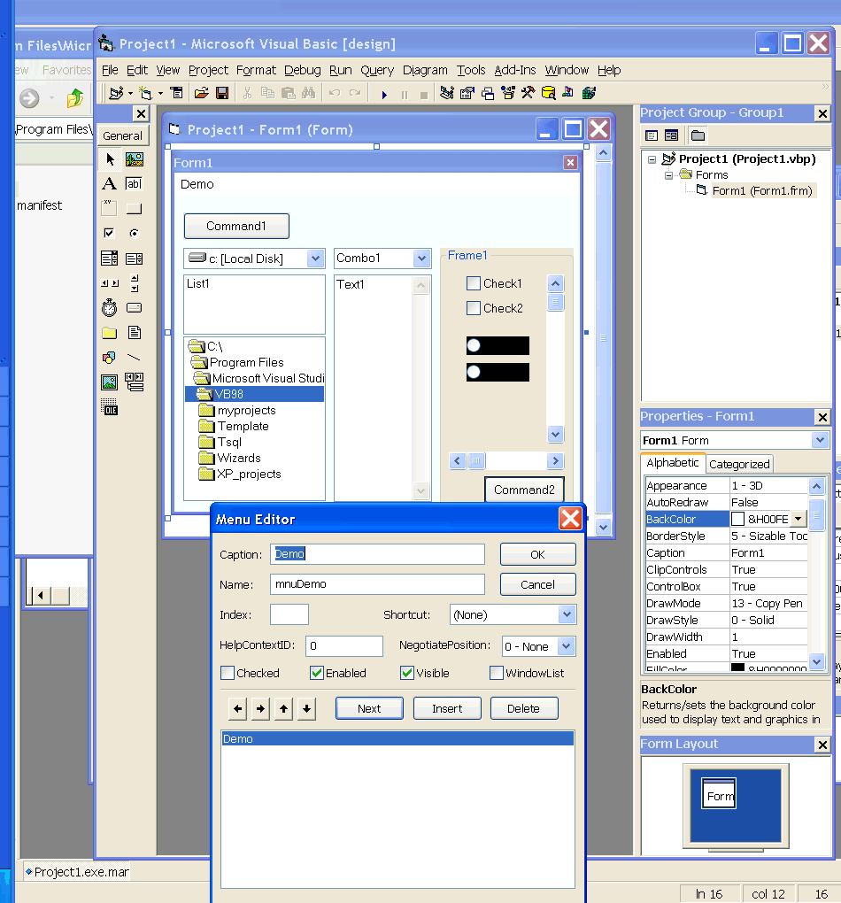

<div align="center">

## VB6 and windows XP styles


</div>

### Description

Edit and run VBasic programs on winXP with the real XP controls Style.

Ship Your Application Both on Windows XP and Earlier Versions of Windows with style ;)
 
### More Info
 


<span>             |<span>
---                |---
**Submitted On**   |
**By**             |[Megalos](https://github.com/Planet-Source-Code/PSCIndex/blob/master/ByAuthor/megalos.md)
**Level**          |Beginner
**User Rating**    |4.3 (13 globes from 3 users)
**Compatibility**  |VB 6\.0
**Category**       |[VB function enhancement](https://github.com/Planet-Source-Code/PSCIndex/blob/master/ByCategory/vb-function-enhancement__1-25.md)
**World**          |[Visual Basic](https://github.com/Planet-Source-Code/PSCIndex/blob/master/ByWorld/visual-basic.md)
**Archive File**   |[](https://github.com/Planet-Source-Code/megalos-vb6-and-windows-xp-styles__1-28388/archive/master.zip)


### Source Code

```
<p>Not many comments here.<br>
Just follow instructions and let me know if you have any problem.<br>
<font color="#800080"><b>1st</b></font><br>
copy this code and create a new file with this name "vb6.exe.manifest" in your
system32 or in the folder where your VB6.exe is.<br>
<br>
<font color="#00CC99">/*--------save as vb6.exe.manifest anything after this
line -----*/</font><br>
<?xml version=<font color="#FF00FF">"1.0"</font> encoding=<font color="#FF00FF">"UTF-8"
</font>standalone=<font color="#FF00FF">"yes"</font>?><br>
<assembly xmlns=<font color="#FF00FF">"urn:schemas-microsoft-com:asm.v1"</font>
manifestVersion=<font color="#FF00FF">"1.0"</font>><br>
<assemblyIdentity type=<font color="#FF00FF">"win32"</font>
processorArchitecture=<font color="#FF00FF">"*"</font> version=<font color="#FF00FF">"6.0.0.0"</font>
name=<font color="#FF00FF">"mash"</font>/><br>
<description>Enter your Description Here</description><br>
<dependency><br>
<dependentAssembly><br>
<assemblyIdentity<br>
type="win32"<br>
name=<font color="#FF00FF">"Microsoft.Windows.Common-Controls"</font> version=<font color="#FF00FF">"6.0.0.0"</font><br>
language=<font color="#FF00FF">"*"</font><br>
processorArchitecture=<font color="#FF00FF">"*"</font><br>
publicKeyToken=<font color="#FF00FF">"6595b64144ccf1df"</font><br>
/><br>
</dependentAssembly><br>
</dependency><br>
</assembly><br>
<br>
<font color="#00CC99">/*----end here-- do not include this line--*/<br>
</font><br>
<font color="#800080"><b>2nd</b></font><br>
start your VBasic and you will see it like it was remade for XP.<br>
after this VB is using the new ComCtl32.dll and is running the applications with
this dll as default.<br>
<b><font color="#800080">3rd</font></b><br>
after you compile the app. you will see that is not using the XP controls
style.!!!???<br>
To use XP style you will need a manifest file like before but with the
applications name this time. so if you have "XPdemo.exe" you will need a file
with the name "XPdemo.exe.manifest" with the same contents like the
"vb6.exe.manifest" or just copy and rename the file "vb6.exe.manifest".<br>
<b><font color="#800080">4th</font></b><br>
put in your applications these lines or it will not work with the XP controls
style.<br>
<font color="#00CC99"><br>
'**************<br>
'just to enable the new ComCtl32.dll if ' is there.</font><br>
<font color="#0000FF">Private Declare Function</font> InitCommonControls
<font color="#0000FF">Lib</font> "comctl32.dll" () As Long<br>
<font color="#0000FF">Private Sub </font>Form_Initialize()<br>
InitCommonControls<br>
<font color="#0000FF">End Sub</font><br>
<font color="#00CC99">'continue with your app. code<br>
'***************<br>
</font><br>
note that your application is still running on any older version windows with no
any problems but he he with not the XP styles.<br>
(under win XP)<br>
the same trick will be possible on any program just use the "programname.exe.manifest"
and you will see.<br>
If you don't have windows XP but you want to give the option to your programs to
run on XP with the XP styles enable just do the same and when your programs run
on XP will be full compatible with the XP styles.<br>
This is some ideas i got reading the MSDN library here.<br>
<a href="http://msdn.microsoft.com/library/default.asp?url=/library/en-us/dnwxp/html/xptheming.asp">
http://msdn.microsoft.com/library/default.asp?url=/library/en-us/dnwxp/html/xptheming.asp</a><br>
and here is my site where im trying to do my best but i dont have much time<br>
<a href="http://sourcecode.pcy.net/">http://sourcecode.pcy.net/ </a>......any
one to help me? :)<br>
CU and have a good day<br>
Megalos Cy<br>
 </p>
```

